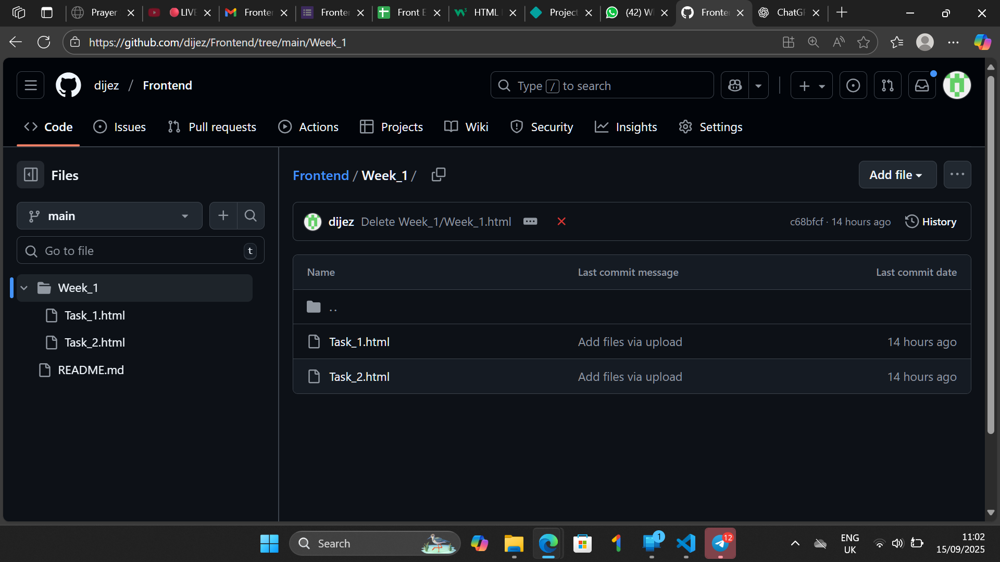

# Frontend-version-control-task-Khadija
deliverables 

<<<<<<< Updated upstream
# Frontend Version Control Task

This repository is for practicing Git and GitHub workflow including branching, commits, pull requests, reviews, merging, reverting, and branch renaming.

=======
## Branches
- feature-header (later renamed to feature-topbar): Contains header UI implementation
- feature-footer: Contains footer UI implementation

## Frequently Used Git Commands
- git init
- git checkout -b branchname
- git add .
- git commit -m "message"
- git push origin branch
- git merge branch
- git revert commit-id
- git branch -m oldName newName
- git fetch --all

## Lessons Learned
- How to create and manage branches properly
- How to write meaningful commit messages
- How to create, review, and merge pull requests
- How to revert mistakes using git revert
- How to rename a branch and fetch updates
>>>>>>> Stashed changes

## PR screenshort

